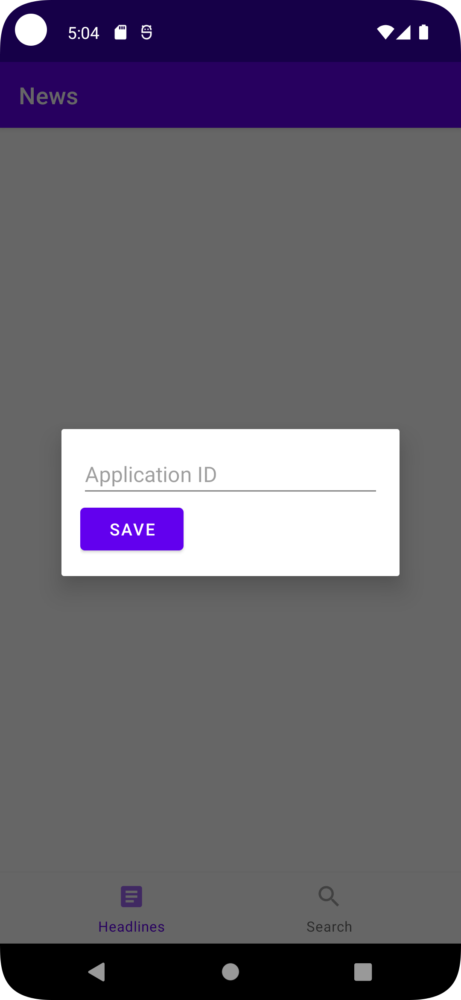

# News

A simple news app to read articles. Backed by https://newsapi.org/

## Usage
First, enter your newsapi `apiKey`:

### Headlines
The headlines tab shows all local headlines. Tap on an article to open the article in your browser.

### Search Tab
The search tab allows you to search through articles.

## Implementation Details

### Components
The app is broken into three main components:
1. `MainActivity`
2. `HeadlinesFragment`
3. `SearchFragment`

#### `MainActivity`
`MainActivity` utilizes the MVI pattern. When the app is started, we first check if `app_id` is set. If not, we display the dialog to enter it. After the `app_id` is set, we then load the `HeadlinesFragment` into the main view. After that, tapping on the tabs emits a `OnHeadlinesSelected` or `OnSearchSelected` event which the `ViewModel` handles by emitting a corresponding state.

#### `HeadlinesFragment`

`HeadlinesFragment` utilizes MVI as well to communicate updates. When the fragment is loaded, it pulls the latest headlines from the repository and displays them. When the user taps an item in the `RecyclerView`, the app opens an `Intent` to open the url.

#### `SearchFragment`
The `SearchFragment` works in a very similar way as the `HeadlinesFragment`, but has a search bar. When new text is typed, the value is debounced for 300ms, then the `ViewModel` hits the search endpoint to find and display articles.

### Notable features

#### Network Requests
newsapi.org is interacted with using Retrofit. Not all parameters are implemented as they fall outside the desired behavior for the app.

#### Dependency Injection
[Koin](https://insert-koin.io/) is used to inject the following:
- All `ViewModel`s
- `NewsApiRepository` for making network requests
- `Retrofit` for making the `NewsApiRepository`
- `ApplicationData` for fetching `appId`
- `UrlOpener` for opening urls in a browser. This functionality is shared between both `Fragment`s
- `ErrorHandler` for displaying toast messages.

#### Tests
Currently, `MainViewModel` and `HeadlinesFragment` are the only components tested, but they are tested thoroughly.

#### MVI
Because MVI is used, the logic runs on a separate coroutine, making the app feel quick and responsive. No work is done on the UI thread that isn't required.

